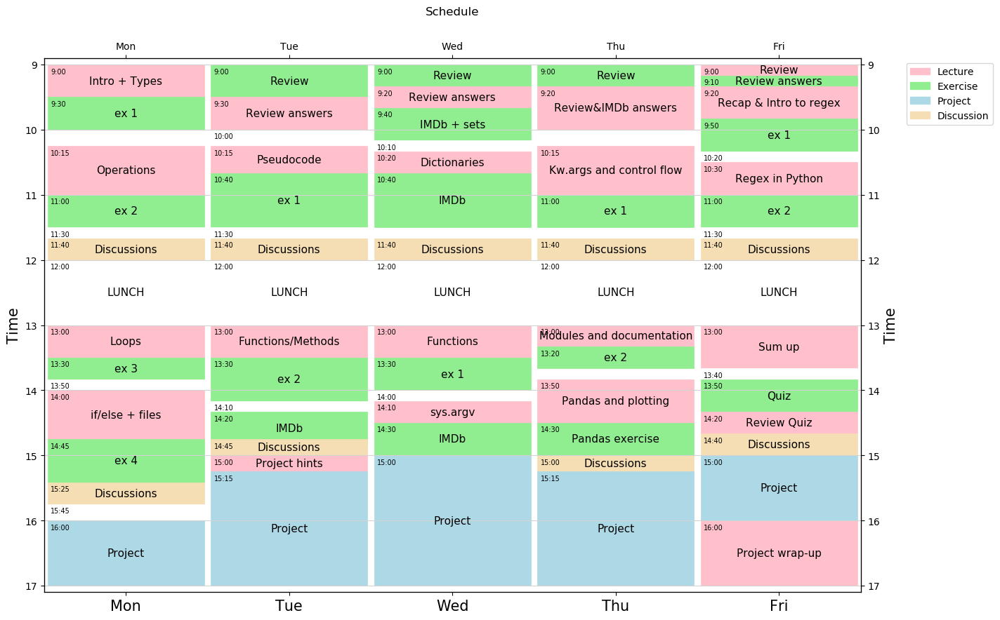

[//]: # (# Description)

This course provides a practical introduction to the writing
of [Python](//www.python.org/) programs for the complete
novice. Participants are lead through the core aspects of Python
illustrated by a series of example programs. Upon completion of the
course, attentive participants will be able to write simple Python
programs from scratch and to customize more complex code to fit their
needs.

> The craft of programming is about taking design decisions to avoid
> overwhelming complexity and permit easy maintenance over time,
> insuring reliability (which goes beyond debugging) and utilizing
> computer resources efficiently.

* The course is suitable for complete beginners and assumes no prior
  programming experience (beyond the ability to use a text editor).
* A very basic knowledge of UNIX would be an advantage, such as
  navigating through folders and issuing commands at a shell
  prompt. We will not teach Unix in detail: Other course are available
  at SciLifeLab for it.

> Before the first lecture, we require you to follow
> these [preliminary steps](preliminary).

# Schedule

From Monday October 19th, to Friday October 23th 2020 (week 43).

# Course Content

During this course, you will learn about:

* Core concepts about Python syntax: Data types, blocks and indentation, variable scoping, iteration, functions, methods and arguments
* Different ways to control program flow using loops and conditional tests
* Regular expressions and pattern matching
* Writing functions and best-practice ways of making them usable
* Reading from and writing to files
* Code packaging and Python libraries
* How to work with biological data using external libraries (if time allows).

# Learning Outcomes

After this course you should be able to:

* Edit and run Python code
* Write file-processing python programs that produce output to the terminal and/or external files.
* Create stand-alone python programs to process biological data
* Know how to develop your skills in Python after the course (including debugging)

### Learning objectives (ie goals for the teachers)

* Increase the student's toolbelt for better quality and performance at work
* Make students understand that there is more to programming than only
  _knowing_ the syntax of a language. This expertise is precisely
  what [NBIS](//nbis.se) provides.

# Format

This year the entire course will be given over Zoom. A link to the Zoom session will be emailed out
to all participants prior to the course. The course will consist of:

* Presentations and demonstrations, given as short online-lectures.
* Practical exercises, where teaching assistants will be at hand helping you.
* A longer Project, which you work on throughout the week.

We do not require you to buy a companion book, as there are already
lots of resources online. However, if you insist, we can
suggest
[_Programming Python_](//shop.oreilly.com/product/9780596158118.do),
[_Learning Python_](//shop.oreilly.com/product/0636920028154.do),
or
[_Programming in Python 3_](//www.amazon.com/Programming-Python-Complete-Introduction-Language/dp/0321680561). Such
books can prove useful for your programming tasks, even after the
course is over.

# Location

This years course will only be given online.
