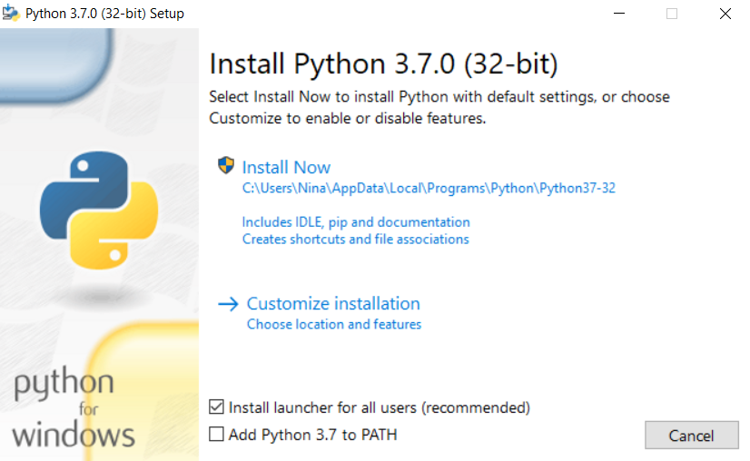
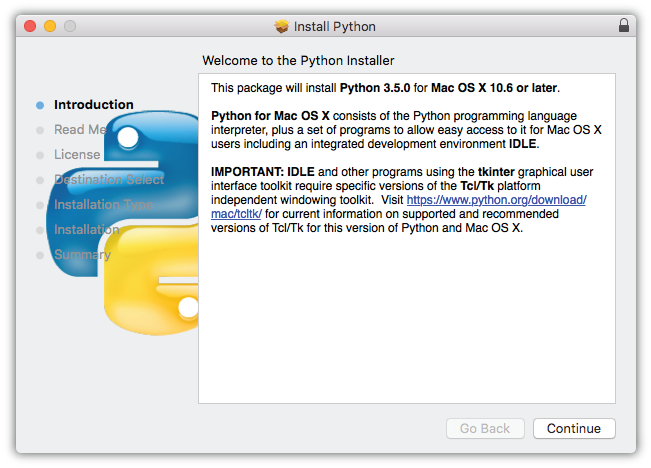

We require you to have a laptop for the practical
exercises. If possible, try to get an extra screen, so
you can both view the presentation and try it out on
your own at the same time.

It is important to come prepared _before_ the first lecture, in order
to fully take advantage of the hands-on exercises, coming at a rather high pace.

We have the 4 following requirements:

1. [Install Python](#how-to-install-python) on your machine
2. [Install dependencies](#install-dependencies) on your machine
3. Make sure you have a [proper text editor](#text-editor)
4. Check that the installation went fine, by [running a given simple script](#test),


----

# How to install Python

> IMPORTANT NOTE: A shortcut for Windows and Mac users is to simple install Anaconda
> as described [further down](#install-dependencies). Anaconda comes with 
> Python pre-installed. Otherwise, install as described here.

Please, choose to install the version `3.6.0` or above. The latest version available is 3.8.5

### On Windows

Here are the [installation steps on Windows](//docs.python.org/3.7/using/windows.html#installation-steps).
The installer should look like:



### On Mac OS X

Since Mac OS X 10.8, Python 2.7 is pre-installed by Apple. This is an incompatible version with this course.
You should instead [download the installer](//www.python.org/ftp/python/3.7.0/python-3.7.0-macosx10.6.pkg) for the version 3.7.0, double-click and follow the instructions.



More information can be found on [docs.python.org/3.7](//docs.python.org/3.7/using/mac.html)

> IMPORTANT NOTE: If you are not interested in a system-wide version
> of Python3, you can use `pyenv` to easily switch between multiple
> versions of Python. You
> can
> [install pyenv from GitHub](//github.com/yyuu/pyenv#installation). After
> installation, you can install version 3.7.0 by issuing the following
> command in your Terminal.
>
> $ pyenv install 3.7.0


### On Linux/Unix
#### Using a package manager
Install Python3 and pip using your package manager. For Ubuntu and Debian, it goes like this:

```
sudo apt-get update
sudo apt-get install python3 python3-pip
```

Then use pip to install Jupyter (see [below](#jupyter) for more details), Biopython and other libraries that will be needed during the course:

```
pip3 install --user jupyter
pip3 install --user biopython
pip3 install --user pandas
pip3 install --user matplotlib
```

#### Installing from source
You can also install [Python from source](https://www.python.org/downloads/).


### A note for Linux/Unix and Mac users
The command to run Python is `python3`. If you wish to be able to start Python by typing just `python`,
add the following line to the file `~/.bashrc` (or `~/.bash_profile`):

`alias python=python3`

----

# How to install dependencies {#install-dependencies}

Later in the course we will try out `pandas` and some plotting, so before that
we have to download those dependencies.

## For Windows

Start by [downloading and installing Anaconda](https://www.anaconda.com/distribution/) if you don't already have it installed.Anaconda is the easiest way to download and manage your python libraries.
Once you have downloaded Anaconda you can open up the Anaconda terminal, and from there use `pip` to install the following:

```
pip install pyreadline

pip install pandas

pip install matplotlib
```

`pyreadline` is a library specifically needed for Windows users, and is not required for Mac or Linux.

## For Mac Os X and Unix/Linux users

Use `pip` to install `pandas` and `matplotlib` as shown above. If you also would like to download Anaconda,
feel free to do that, it is a very convenient package and environment manager not just for this course.


# Using a proper Text Editor {#text-editor}

We are going to type (a lot of) Python code, so you'd better have a
good text editor. This is useful for several reasons: The text editor
can highlight the Python keywords and handles the particulars
regarding tabulations (which we will introduce in the course).

<div id="text-editors">

Emacs and Vim are probably the best text editors, albeit for
tech-savvy people.


If you are not the latter
kind, <a href="//www.sublimetext.com/">Sublime Text</a>
or <a href="//atom.io/">Atom</a> are excellent cross-platform
alternative. You should probably customize it to your taste first.


Another alternative is <a
href="//www.jetbrains.com/pycharm/">PyCharm</a>. It looks promising
but we admit we did not really try it. Go ahead, <a
href="//www.jetbrains.com/help/pycharm/requirements-installation-and-launching.html">install
the free version</a> and give it a try!
<a
href="//www.jetbrains.com/help/pycharm/requirements-installation-and-launching.html"></a>
</div>

----

# Testing your installation {#test}

Start your favorite terminal and check the Python version. Type at the
prompt (ie where the `$` sign is):

```bash
$ python3 --version
```

or start the python interpretor

```bash
$ python3
```

[//]: # (Upon successful installation, you should see something like)

[//]: # ()

## Running a test script

Download this
[test script](//raw.githubusercontent.com/NBISweden/PythonCourse/ht20/test.py) (from
the NBIS GitHub location for this instance of the course), or get it by downloading the zip archive
with all the files needed for the course from <a href="https://minhaskamal.github.io/DownGit/#/home?url=https://github.com/NBISweden/workshop-python/tree/ht20/downloads" download>here.
</a>
In your terminal, run:

```bash
$ python3 test.py
```

...in the folder where the script resides. If this works fine, you
should see the current time printed with "big digits" ;)


----

# Jupyter notebooks {#jupyter}

In the course, we will write Python code as standalone files. However,
during the lecture, we will also use Jupyter
Notebook. [Jupyter](//jupyter.org/) is a web-based tool which
allows us to evaluate our code line by line.  The Jupyter files are
called
[notebooks](//jupyter.readthedocs.io/en/latest/running.html) and
will serve a single purpose in this course: a _quick demonstration_ of
Python code. It is therefore convenient, though optional,
to
[install Jupyter](//jupyter.readthedocs.io/en/latest/install.html) in
advance.


----

# Impatient about the first lecture?

Whet your appetite on
the [Python tutorial](//docs.python.org/3/tutorial/) or
an
[informal introduction to Python](//docs.python.org/3/tutorial/introduction.html).
