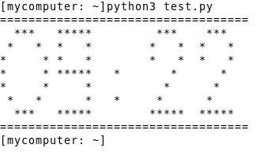

We require you to have a laptop (with Linux, or Mac) for the practical
exercises. If you do not have one, or want to borrow one from us,
please contact us at education@scilifelab.uu.se before the beginning
of the course.

_Before_ the first lecture, we have the 3 following requirements:

1. [Install Python](#how-to-install-python) on your machine (obviously),
2. Check that the installation went fine, by [running a given simple script](#test),
3. Make sure you have a [proper text editor](#text-editor)

----

# How to install Python

On the [Python website](//www.python.org/downloads/), the latest
version available is `3.6.0`. Please, choose to install the version
`3.5.0` or above.  You can install the latest Python
on
[Windows](//www.python.org/downloads/windows/),
[Mac OS X](//www.python.org/downloads/mac-osx/)
or [Linux/Unix](//www.python.org/downloads/source/).

### On Windows

You can borrow a Linux laptop where we have installed Python 3.5+ for you.
If you insist on using your own Windows machine, here are the [installation steps on Windows](//docs.python.org/3.5/using/windows.html#installation-steps).
The installer should look like:

### On Mac OS X

Since Mac OS X 10.8, Python 2.7 is pre-installed by Apple. This is an incompatible version with this course.
You should instead [download the installer](//www.python.org/ftp/python/3.5.0/python-3.5.0-macosx10.6.pkg) for the version 3.5.0 (or choose a newer one), double-click and follow the instructions.

                                            
More information can be found on [docs.python.org/3.5](//docs.python.org/3.5/using/mac.html)

> IMPORTANT NOTE: If you are not interested in a system-wide version
> of Python3, you can use `pyenv` to easily switch between multiple
> versions of Python. You
> can
> [install pyenv from GitHub](//github.com/yyuu/pyenv#installation). After
> installation, you can install version 3.5.0 by issuing the following
> command in your Terminal.
> 
> $ pyenv install 3.5.0

### On Linux/Unix

You probably
know [what to do](//docs.python.org/3.5/using/unix.html) if we
give you
the
[Python 3.5.0 sources](//www.python.org/ftp/python/3.5.0/Python-3.5.0.tgz). You
are surely familiar with the classic cycle:

	./configure
	make
	make test
	sudo make install

----

# Testing your installation {#test}

Start your favorite terminal and check the Python version. Type at the
prompt (ie where the `$` sign is):

	$ python --version

or start the python interpretor

	$ python

[//]: # (Upon successful installation, you should see something like)

[//]: # ()

## Running a test script

Download
this
[test script](//raw.githubusercontent.com/NBISweden/PythonCourse/vt17/test.py) (from
the NBIS GitHub location for this instance of the course), and in your
terminal, run

	$ python test.py

...in the folder where the script resides. If this works fine, you
should see the current time printed with "big digits" ;)

Alternatively, copy-paste that line at the prompt

	curl -s https://raw.githubusercontent.com/NBISweden/PythonCourse/vt17/test.py | python

----

# Using a proper Text Editor {#text-editor}

We are going to type (a lot of) Python code, so you'd better have a
good text editor. This is useful for several reasons: The text editor
can highlight the Python keywords and handles the particulars
regarding tabulations (which we will introduce in the course).

Emacs and Vim are probably the best text editors, albeit for
tech-savvy people. If you are not the latter
kind, [Sublime Text](//www.sublimetext.com/)
or [Atom](//atom.io/) are excellent cross-platform
alternative. You should probably customize it to your taste first.

----

# Jupyter notebooks
{:.collapse-trigger}

In the course, we will write Python code as standalone files. However,
during the lecture, we will also use Jupyter
notebooks. [Jupyter](//jupyter.org/) is a web-based tool which
allows us to evaluate our code line by line.  The Jupyter files are
called
[notebooks](//jupyter.readthedocs.io/en/latest/running.html) and
will serve a single purpose in this course: a _quick demonstration_ of
Python code. It is therefore convenient, though optional,
to
[install Jupyter](//jupyter.readthedocs.io/en/latest/install.html) in
advance.

----

# Impatient about the first lecture?

Whet your appetite on
the [Python tutorial](//docs.python.org/3/tutorial/) or
an
[informal introduction to Python](//docs.python.org/3/tutorial/introduction.html).
